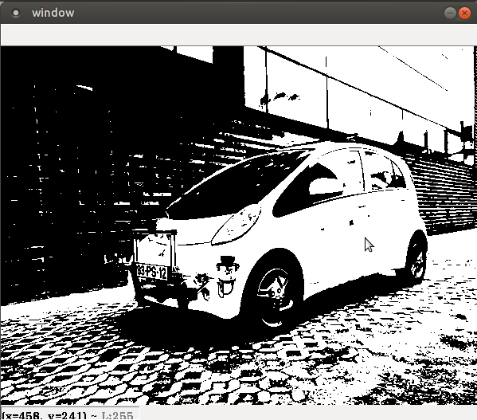
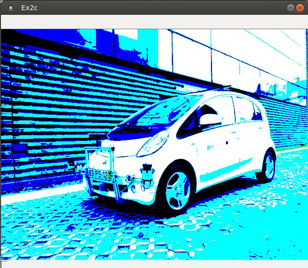
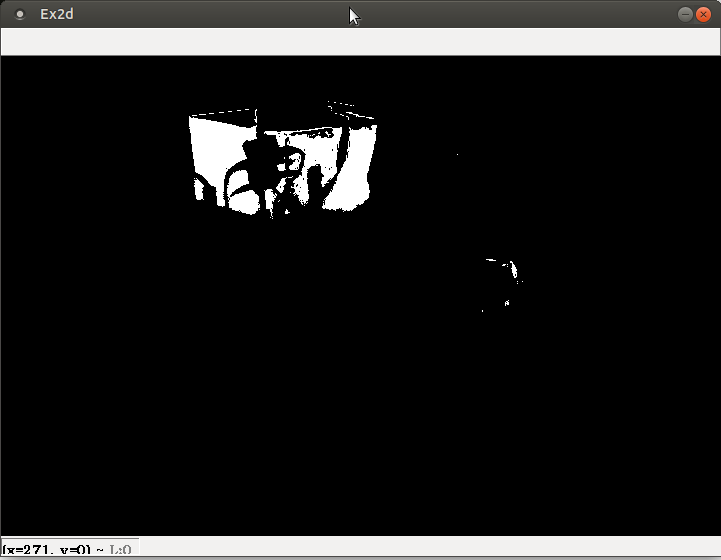
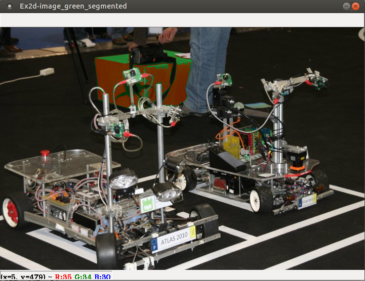
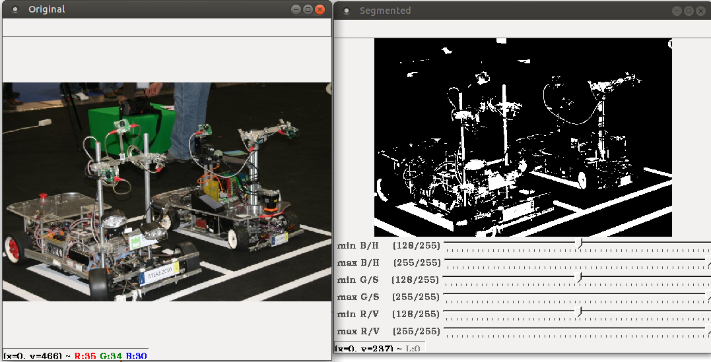

= Parte 5 - PSR

Miguel Riem Oliveira <mriem@ua.pt>
2022-2023

// Instruções especiais para o asciidoc usar icons no output
:icons: html5
:iconsdir: /etc/asciidoc/images/icons

.Sumário
-------------------------------------------------------------
Introdução ao OpenCV.
-------------------------------------------------------------

O opencv é uma biblioteca muito poderosa para fazer processamento de imagem e visão artificial, entre outras funcionalidades. A partir da versão 3 orientou-se
especialmente para programação em C{plus}{plus} e Python.

Instalação
----------

Para instalar o opencv com os bindings em python usar o comando:

   sudo apt-get install python3-opencv

Mais informação em https://docs.opencv.org/master/d2/de6/tutorial_py_setup_in_ubuntu.html

Para saber a versão instalada do opencv pode, num terminal python fazer:

    import cv2
    cv2.__version__

Exercício 1 - Leitura de imagens
--------------------------------

As imagens para teste estão presentes na pasta docs da pasta desta aula.

1 a)
~~~~~

Implemente o seguinte código para leitura e display de uma image usando o opencv. Mais informação neste https://docs.opencv.org/3.1.0/dc/d2e/tutorial_py_image_display.html[tutorial].

[source,Python]
-----------------------------------------------------------------
import cv2

def main():

    image_filename = 'path to my image .png'
    image = cv2.imread(image_filename, cv2.IMREAD_COLOR) # Load an image

    cv2.imshow('window', image)  # Display the image
    cv2.waitKey(0) # wait for a key press before proceeding

if __name__ == '__main__':
    main()
-----------------------------------------------------------------

1 b)
~~~~~

Adicione a funcionalidade de inserir o nome (full path) da imagem a ler. Experimente ler as imagens dos dois atlascars que estão na pasta _images_ (atlascar.png e atlascar2.png).

====================
Use o package argparser
====================

1 c)
~~~~~

Altere o script de modo a que o programa mostre alternadamente os dois atlascars na mesma janela. A mudança de carro mostrado deve dar-se a cada 3 segundos.

====================
O primeiro argumento da função _cvWaitKey_ é o número máximo de milisegundos a esperar por uma tecla.

Em alternativa pode usar a função https://www.datacamp.com/community/tutorials/python-time-sleep?utm_source=adwords_ppc&utm_campaignid=898687156&utm_adgroupid=48947256715&utm_device=c&utm_keyword=&utm_matchtype=b&utm_network=g&utm_adpostion=&utm_creative=332602034352&utm_targetid=dsa-429603003980&utm_loc_interest_ms=&utm_loc_physical_ms=1011706&gclid=Cj0KCQjwwOz6BRCgARIsAKEG4FVkKPOEdKcj7_vQ9aU-6TrPIhvgDYeR_3WXZsgRAOPOHLIDb_abi3IaAgAEEALw_wcB[sleep do package time].
====================

Exercício 2 - Processamento de imagem
-------------------------------------

2 a)
~~~~

Carregue uma imagem do atlascar e binarize-a usando a função:

[source,Python]
----------------
retval, image_thresholded = cv2.threshold(image_gray, 128, 255, cv2.THRESH_BINARY)
----------------

====================
Todas as funções do opencv estão documentadas em https://docs.opencv.org/master/index.html
====================

.Resultado esperado
[caption=""]

2 b)
~~~~

Nos bindings para opencv de python, as imagens são representadas por numpy nd arrays, que são arrays n-dimensionais. Para imagens de 640x480 de cor, por exemplo, os arrays terão o tamanho 480 (linhas) x 640 (colunas) x 3 (canais de cor).

====================
Pode imprimir o tipo do uma qualquer variável em python usando a função type:

    print(type(image))

Para ver o tamanho de um numpy array use:

    print(image.shape)

Para ver o tipo de dados (data type) dos elementos do numpy ndarray use:

    print(image.dtype)
====================

https://numpy.org/[Numpy] é uma biblioteca python muito eficiente para cálculo matricial (a razão pela qual foi usada pelos bindings para python em opencv). O numpy é semelhante ao matlab na síntaxe e forma de operar matricial.

Assim, pode fazer alterações às imagens operando-as como se fossem matrizes em numpy. Sendo _image_ uma variável do tipo numpy ndarray, pode simplesmete usar uma comparação:

    image_thresholded = image > 128

Substitua a alínea _2 a)_ de modo a fazer a binarização usando o operador numpy ndarray. Deverá ter o mesmo resultado.

====================
Veja qual o tipo de dados de saída da _image_threshold_ quando usa a função do opencv e quando usa o operador numpy.
====================

2 c)
~~~~
Utilize a função cv2.split() para separar a imagem _atlascar2.png_ nos seus três canais de cor (b,g,r). Cada canal deverá ser binarizado usando diferentes limites de binarização (b=50,g=100,r=150). Posteriormente, as imagens binarizadas de cada canal deverão ser concatenadas (cv2.merge) para formar uma nova imagem RGB, a mostrar numa janela.

.Resultado esperado
[caption=""]

2 d)
~~~

Leia a imagem _atlas2000_e_atlasmv.png_.

Usando a função _cv2.inRange_ crie uma máscara dos pixeis com valores de rgb entre (bmin, gmin, rmin) e (bmax, gmax, rmax). Parametrize de modod a segmentar o caixote verde por trás dos robôs.

.Resultado esperado
[caption=""]

====================
Se mostrar a imagem original com o imshow pode depois colocar o rato sobre a zona do caixote para inspeccionar o valor típico dos pixeis naquele objeto.
====================

2 e)
~~~

Faça a segmentação do mesmo objeto (cor verde) desta vez usando o modelo de cor HSV. O resultado deve ser o mesmo que na alínea anterior.

====================
Para converter de BGR para HSV
[source,Python]
----------------
image_hsv = cv.cvtColor(image_rgb, cv2.COLOR_BGR2HSV)
----------------
====================

2 f)
~~~

Usando uma adição da imagem original por um escalar para cada canal, pinte de vermelho o caixote verde detetado na alínea anterior.

.Um resultado possível
[caption=""]

Exercício 3 - Graphical user interface
--------------------------------------

As graphical user interfaces são, como o nome indica, ferramentas de interação com o utilizador. São muito úteis como alternativa à inserção de texto no terminal.

3 a)
~~~~
Partindo do _exercício 2 a)_ implemente uma trackbar que permita ao utilizador definir o limite de binarização a ser utilizado na binarização.

Ver instruções sobre https://docs.opencv.org/3.4/da/d6a/tutorial_trackbar.html[trackbars em opencv].

[source,Python]
-----------------------------------------------------------------
import argparse
import cv2

# Global variables
window_name = 'window - Ex3a'
image_gray = None

def onTrackbar(threshold):
    # Add code here to threshold image_gray and show image in window

def main():
    parser = argparse.ArgumentParser()
    parser.add_argument('-i', '--image', type=str, required=True,help='Full path to image file.')
    args = vars(parser.parse_args())

    image = cv2.imread(args['image'], cv2.IMREAD_COLOR)  # Load an image
    global image_gray # use global var
    image_gray = cv2.cvtColor(image, cv2.COLOR_BGR2GRAY)  # convert bgr to gray image (single channel)
    cv2.namedWindow(window_name)

    # add code to create the trackbar ...
    cv2.waitKey(0)

if __name__ == '__main__':
    main()
-----------------------------------------------------------------

3 b)
~~~~

Apesar de funcional, o Exercício _3 a)_ tem o problema de necessitar de variáveis globais, que o são por terem de ser acedidas quer pela função _main_ quer pela função _onTrackbar_. Ler mais aqui sobre o https://www.datacamp.com/community/tutorials/scope-of-variables-python?utm_source=adwords_ppc&utm_campaignid=898687156&utm_adgroupid=48947256715&utm_device=c&utm_keyword=&utm_matchtype=b&utm_network=g&utm_adpostion=&utm_creative=229765585186&utm_targetid=dsa-429603003980&utm_loc_interest_ms=&utm_loc_physical_ms=1011706&gclid=Cj0KCQjwwOz6BRCgARIsAKEG4FXVGtlBHc6VmZN0XsQ4s1jVjldG5sOlV50Od66LKdXOulnWYa190AAaAgxlEALw_wcB[scope de variáveis]

As variáveis globais não são recomendadas por terem https://www.reddit.com/r/Python/comments/25jzga/what_exactly_makes_global_variables_so_bad/[vários problemas].

Altere o _Ex 3 a)_ de modo a não utilizar variáveis globais.

====================
Será necessário que a função receba como argumentos todas as variáveis de que necesita. Ver as funcionalidades da função https://docs.python.org/2/library/functools.html#partial-objects[partial].
====================

3 c)
~~~~

Partindo do _Ex3 b)_ e usando a funçao https://docs.opencv.org/2.4/modules/highgui/doc/user_interface.html?highlight=setmousecallback#setmousecallback[setMouseCallback] acrescente a funcionalidade de imprimir as coordenadas do rato sempre que se pressiona o botão esquerdo do rato.

3 d)
~~~~

Implemente um programa que permita configurar a segmentação de cor. O programa deve executar a segmentação verificando quais os pixeis da imagem que estão dentro de certos limites mínimo e máximo. Estes limites deverão ser diferentes para cada canal de cor. O programa deve mostrar 6 trackbars no total, para configurar aqueles limites:

    .. limite mínimo e máximo para o canal B (ou H)
    .. limite mínimo e máximo para o canal G (ou S)
    .. limite mínimo e máximo para o canal R (ou V)

De cada vez que o utilizador alterar uma trackbar o valor do limite correspondente altera-se, e portanto é preciso realizar nova segmentação e mostrar o resultado.

A aplicação deve poder receber um argumento pela linha da comando que indique que deve operar com uma imagem HSV em vez da habitual BGR.

A aplicação deve utilizar um dicionário python com informação sobre os limites das variáveis como descrito em baixo.

[source,Bash]
-----------------------------------------------------------------
{'limits': {'B': {'max': 200, 'min': 100},
            'G': {'max': 200, 'min': 100},
            'R': {'max': 200, 'min': 100}}}
-----------------------------------------------------------------

Quando termina a aplicaçao devera gravar um ficheiro _limits.json_ com o dicionario descrito em cima.

============================================
Exemplo para gravar um dicionário para um ficheiro json.

[source,Python]
-----------------------------------------------------------------
file_name = 'limits.json'
with open(file_name, 'w') as file_handle:
    print('writing dictionary d to file ' + file_name)
    json.dump(d, file_handle) # d is the dicionary
-----------------------------------------------------------------
============================================

.A aplicação de segmentação de cor.
[caption=""]

Aqui um exemplo da https://youtu.be/5ehqBuBWQZM[aplicação em funcionamento]

