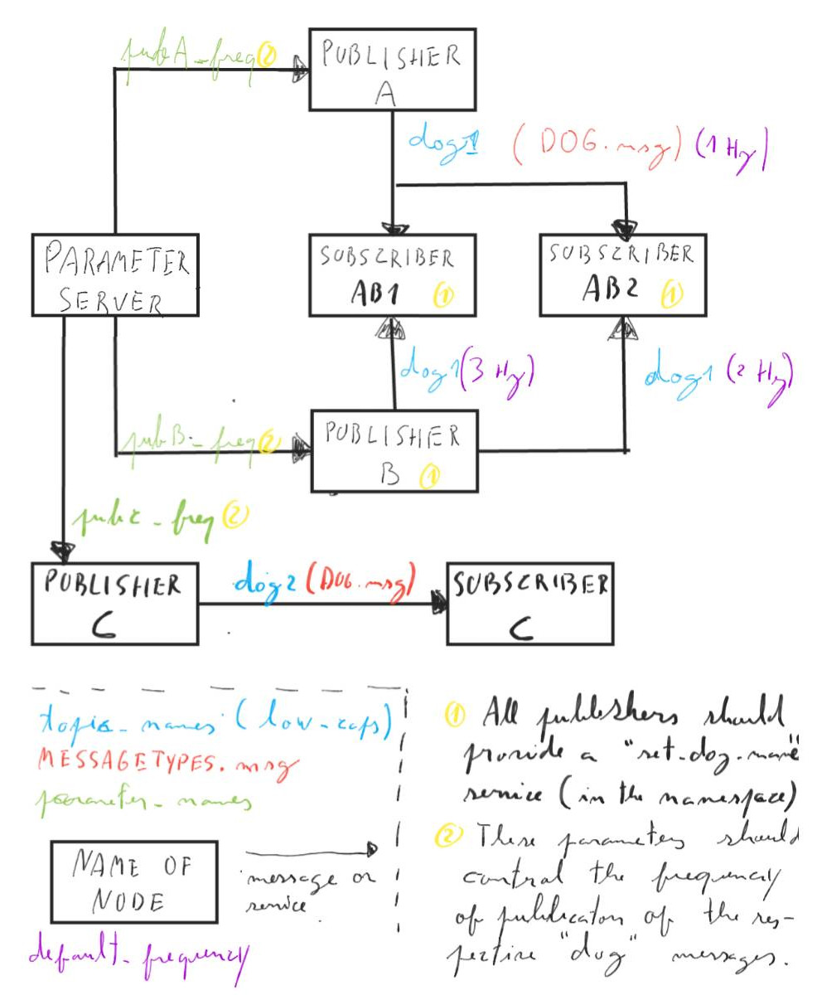
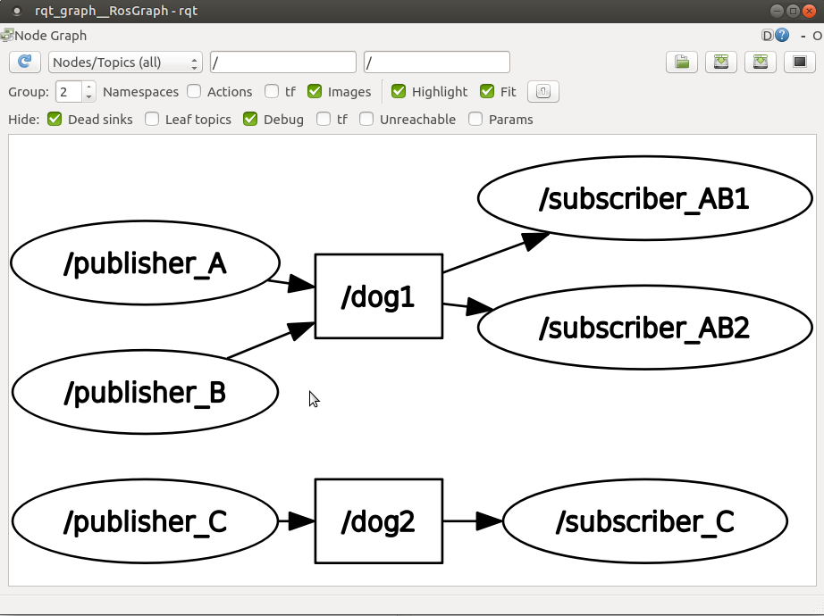
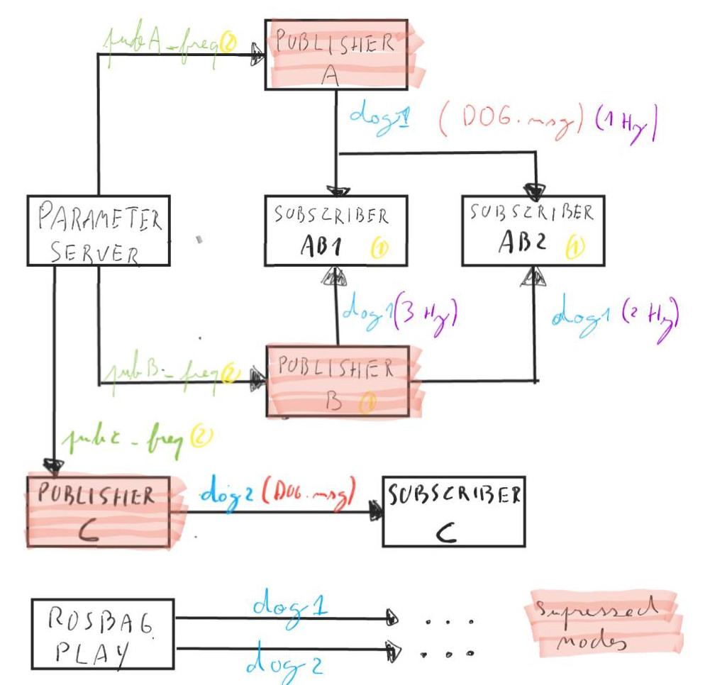
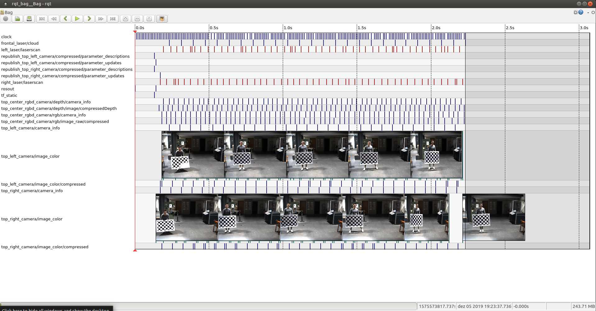

= Parte 9 - PSR

Miguel Riem Oliveira <mriem@ua.pt>
2022-2023

// Instruções especiais para o asciidoc usar icons no output
:icons: html5
:iconsdir: /etc/asciidoc/images/icons

.Sumário
-------------------------------------------------------------
Configuração de nós em ROS - nomes e parâmetros
Ficheiros ros launch
Ficheiros de log em ros
-------------------------------------------------------------

Exercício 1 - Remapeamento de nomes
-----------------------------------

O ROS tem como uma das suas características fundamentais a possibilidade de reutilização de código.
Assim, de modo a permitir o lançamento de vários nós a partir de um único código é importante conseguir alterar
os nomes de várias entidades do código.

Um exemplo: para lançar dois nós ROS a partir do mesmo código, é necessário que não tenham o mesmo nome.
Uma solução é a que foi utilizada na aula passada com nomes anónimos, mas também é possível remapear o nome do nó quando este é lançado.

um _nome_ em ROS é um conjunto alargado de propriedades dos nós, e http://wiki.ros.org/Names[todas elas podem ser remapeadas]. Um exemplo é o nome do nó, mas
também se pode http://wiki.ros.org/Remapping%20Arguments[remapear nomes de tópicos, serviços ou parâmetros].

Neste exercício pretende-se alterar o código do exercício 3 da aula passada de modo a que seja possível alterar o nome do nó _publisher.py_ bem como o tópico em que publica.

.Exemplo de chamada o publicador com remapeamento de nome de nó, tópicos e serviços
[source,bash]
-----------------------------------------------------------------
rosrun psr_aula9_ex1 publisher.py chatter:=my_chat __name:=my_node ~set_dog_name:=set_my_dog_name
-----------------------------------------------------------------

============================================
O remapeamento de nomes em ROS colide com o argument parser. Apesar de ser possível colocar os dois a funcionar em simultâneo (usando a funcionalidade https://www.kite.com/python/docs/argparse.ArgumentParser.parse_known_args[parse_known_args]), isso não é relevante para esta aula, e portanto sugere-se a remoção do argument parser.
============================================

Exercício 2 - Parâmetros em ROS
-------------------------------

_ROS params_ são variáveis que são definidas no início do programa (ou mesmo durante a execução, em softwares mais avançados) e que
configuram o comportamento do nó. O ROS aborda o problema da parametrização de nós de uma forma distribuída (em linha com a filosofia geral).
Assim, há um nó chamado http://wiki.ros.org/Parameter%20Server[_parameter server_] que tem a função de guardar o valor de cada parâmetro e de disponibilizar um serviço
que permita ler e escrever o valor desses parâmetros. Deste modo qualquer nó consegue consultar o valor de um parâmetro usando um destes serviços.

Crie um novo parâmetro em ROS chamado _highlight_text_color_, que irá definir a cor a usar para destacar texto nos nós publisher.py e subscriber.py.
o valor deste parâmetro deverá ser uma string com uma das cores https://stackoverflow.com/questions/61686780/python-colorama-print-all-colors[disponíveis na biblioteca colorama.Fore]

============================================
Pode criar o parâmetro com o comando _rosparam_, e.g.:

[source,Bash]
-----------------------------------------------------------------
rosparam set highlight_text_color GREEN
-----------------------------------------------------------------

e depois pode consultar a lista de parâmetros:

[source,Bash]
-----------------------------------------------------------------
rosparam list
-----------------------------------------------------------------

finalmente, pode ainda ler o valor de um parâmetro:

[source,Bash]
-----------------------------------------------------------------
rosparam get highlight_text_color
-----------------------------------------------------------------
============================================

Partindo do exercício anterior, adapte de modo a que os scripts _publisher.py_ e _subscriber.py_ imprimam as suas mensagens com a cor configurada no parâmetro acima descrito.

Os programas devem http://wiki.ros.org/rospy/Overview/Parameter%20Server[ler o parâmetro] durante a inicialização.

============================================
É possível também que os nós sejam notificados quando houver uma alteração do valor do parâmetro, mas essa http://library.isr.ist.utl.pt/docs/roswiki/ROSNodeTutorialPython.html[solução é mais complexa] e não é relevante para esta aula.
============================================

Exercício 3 - Parâmetros privados
---------------------------------

Adicione um parâmetro privado do nó _publisher.py_ que permita alterar a frequência de publicação.

Exercício 4 - Ficheiro de Parâmetros
------------------------------------

O ROS permite ainda a leitura de um https://roboticsbackend.com/ros-param-yaml-format/[ficheiro do tipo _yaml_] com um conjunto de parâmetros e seus respetivos valores.
Esta solução é útil quando se tem dezenas ou mesmo centenas de parâmetros.

Crie um ficheiro yaml numa pasta _params_ na raiz do seu package.

============================================

.Exemplo do ficheiro params/params.yaml
[source,Yaml]
-----------------------------------------------------------------
highlight_text_color: "MAGENTA"
my_name: "Miguel"
-----------------------------------------------------------------
============================================

e depois leia o ficheiro com o comando:

[source,Bash]
-----------------------------------------------------------------
rosparam load params.yaml
-----------------------------------------------------------------

Exercício 5 - Ficheiros roslaunch
---------------------------------

Os http://wiki.ros.org/roslaunch[ficheiros roslaunch] são usados como scripts para lançamento e configuração de multiplos nós ros.
Têm várias http://wiki.ros.org/roslaunch/XML[funcionalidades úteis], como argumentos de entrada, possibilidade de chamar outros launch files, remapeamento de nomes, set de parâmetros, etc.

Suponha que, numa reunião de kick-off de um projeto de software é discutida a implementação de um sistema com vários programas e parâmetros de configuração.
A título de exemplo vamos continuar a utilizar os nós dos últimos exercícios. Dessa reunião resultou o seguinte esboço:

.Esboço do sistema

Crie um ROS package com o nome _psr_aula9_ex4_bringup_  (bringup é um sufixo normalmente dado aos ros packages que fazem o lançamento de sistemas).
Nesse pacote, na pasta _launch_ crie um _bringup.launch_ que faça o lançamento do sistema esquematizado.

.Exemplo de um launch file simples.
[source,xml]
-----------------------------------------------------------------
<launch>
  <node name="talker" pkg="rospy_tutorials" type="talker" />
</launch>
-----------------------------------------------------------------

Posteriormente, utilize o _rqt_graph_ para inspecionar o sistema e verificar que está conforme com o esboço.

.Um exemplo do que pode ver com o _rqt_graph_.

============================================
Os nós devem imprimir para o terminal (ver http://wiki.ros.org/roslaunch/XML/node[opções do <node>]).

Pode incluir o rqt_graph também no launch file.
============================================

============================================
Pode ver exemplos de launch files mais complexos, por exemplo no caso do https://github.com/lardemua/atlascar2/tree/master/atlascar2_bringup/launch[AtlasCar2].
============================================

Exercício 6 - Logging em ROS
----------------------------

Um _log_ é um ficheiro que regista vários eventos que ocorreram durante a sessão de gravação do log.
Um dos problemas das aplicações robóticas é muitas vezes a dificuldade em lidar com harware, uma vez que este nem sempre está disponível, ou o processo
de inicialização do mesmo é complexo e moroso. Por outro lado, os dados reais recolhidos por hardware não são repetidos (existe sempre uma flutuação nos dados).
Isto impede a afinação de um algoritmo usando sempre os mesmos dados de entrada.

http://wiki.ros.org/rosbag[O ROS implementa um sistema de logging] suportado na sua arquitetura distribuida: o que é gravado são as mensagens que
são enviadas entre nós. O utilizador pode escolher que mensagens devem ser gravadas, e o ficheiro criado pelo processo de gravação (um _bagfile_)
pode depois posteriormente ser lido sequencialmente recreando o tráfego de mensagens ocorrido durante a sessão gravada.
Isto confere grande flexibilidade ao sistema de logging.

Usando a http://wiki.ros.org/rosbag/Commandline[command line interface para bag files] e partindo do exercício anterior,
grave um bag de cerca de meio minuto com os tópicos _dog1_ e _dog2_.

Depois, numa nova sessão (lembre-se que deve desligar o roscore entre sessões) lance um sistema em que os publicadores são suprimidos,
mas as mensagens nos tópicos _dog1_ e _dog2_ são publicadas pelo playback do bag file que foi previamente gravado.

.Esquema do novo sistema com playback de mensagens gravadas.

.Exemplo do output do comando _rosbag info <bagfile_gravado_neste_exercício>_.
[source,bash]
-----------------------------------------------------------------
➜  ~ rosbag info 2020-09-25-12-06-27.bag
path:        2020-09-25-12-06-27.bag
version:     2.0
duration:    6.3s
start:       Sep 25 2020 12:06:27.61 (1601031987.61)
end:         Sep 25 2020 12:06:33.94 (1601031993.94)
size:        9.6 KB
messages:    39
compression: none [1/1 chunks]
types:       psr_aula8_ex4/Dog [d3e481097da3769123b9dd1b566c9cb3]
topics:      dog1   26 msgs    : psr_aula8_ex4/Dog (2 connections)
             dog2   13 msgs    : psr_aula8_ex4/Dog
-----------------------------------------------------------------

============================================
Sugestão para o launch file: adicione um argumento de entrada _run_publishers_ cujo valor determina se os nós publicadores são lançados e, caso não sejam, seja lançado o playback de um bagfile.
============================================

Exercício 7 - Visualização de um bagfile
----------------------------------------

Descarregue este https://drive.google.com/file/d/1ILWRdSnRWpq3lWjgLCzMH5-o-abw2x8r/view?usp=sharing[bagfile], inspecione-o com o _rosbag info_ e faça o seu playback.

Visualize as mensagens publicadas com o _rostopic echo_ e outras ferramentas.

.Playback do bagfile usando a ferramenta _rqtbag_

