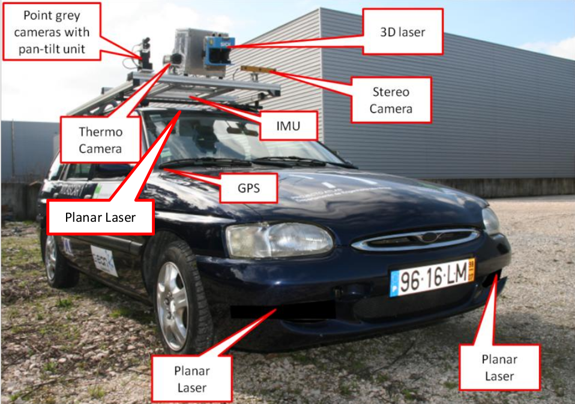
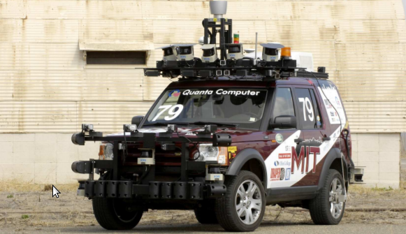
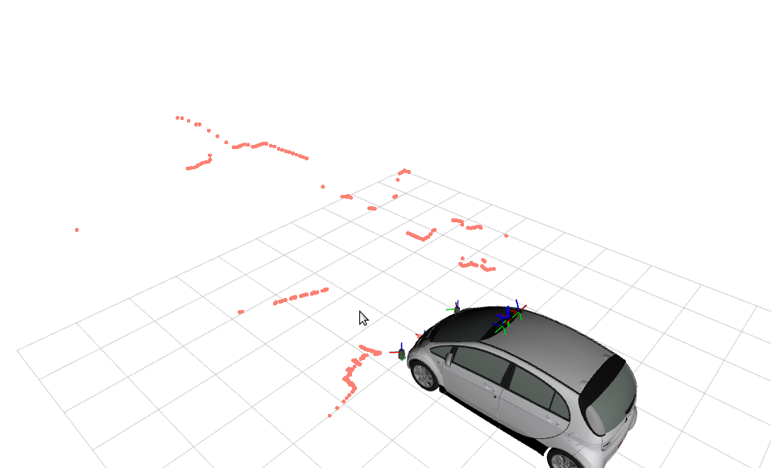
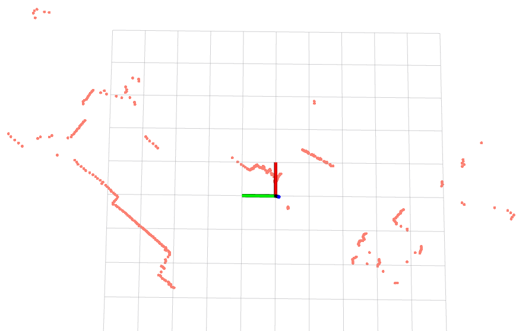
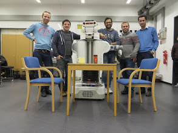
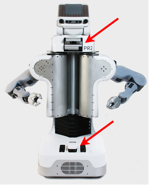
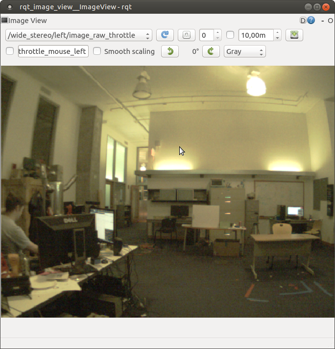
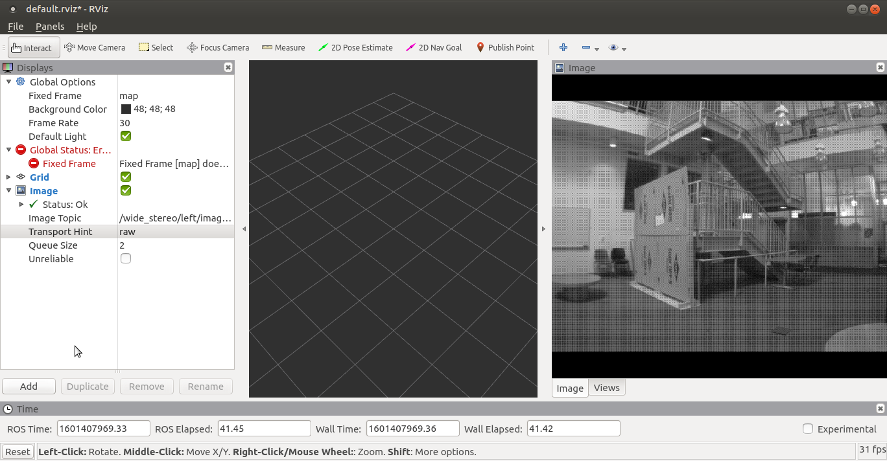
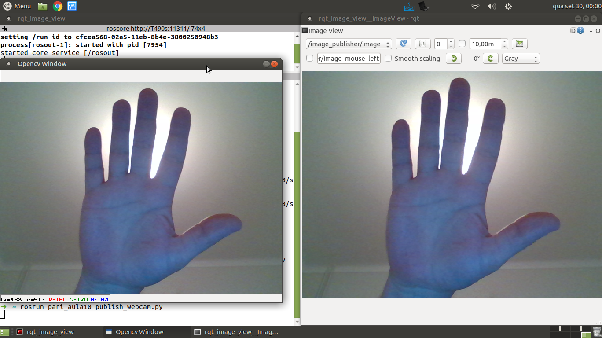

= Parte 10 - PSR

Miguel Riem Oliveira <mriem@ua.pt>
2022-2023

// Instruções especiais para o asciidoc usar icons no output
:icons: html5
:iconsdir: /etc/asciidoc/images/icons

.Sumário
-------------------------------------------------------------
Sensores mais utilizados em robótica
Mensagens standard em ROS (sensor_msgs)
Visualização de mensagens com o RVIZ
-------------------------------------------------------------

Um sensor é um aparelho que permite adquirir informação sobre o meio onde está inserido.
Os sistemas robóticos mais complexos têm por vezes dezenas de sensores a bordo.
Por exemplo, o robô http://atlas.web.ua.pt/[Atlascar2], que foi o https://www.youtube.com/watch?v=f4U0UPkai58[primeiro veículo autónomo em Portugal numa demonstração em 2011], continha uma grande variedade de sensores a bordo.

.O Atlascar, o primeiro veículo autónomo em Portugal.

Outro exemplo interessante é o veículo _Talos_ que foi o concorrente ao DARPA challenge do _MIT_.

.O _Talos_ do _MIT_.

Existem vários sensores frequentemente utilizados em robótica, mas são sobretudo de 3 tipos, tendo em conta a natureza da informação que adquirem :

1. Sensores que adquirem informação de distâncias, e.g. Lidars, 3D Lidars, RGBD cameras, etc;
2. Sensores que adquirem outra informação que não a distância. Habitualmente medem radiação no espectro visível (câmaras RGB clássicas), ou no infravermelho (câmaras térmicas);
3. Sensores que adquirem informação sobre o próprio sistema robótico, e.g. acelerómetros, bússulas, IMUs, GPSs, etc.

Nesta aula serão descritos vários sensores bem como as mensagens utilizadas em ROS para representar os dados de cada um deles.

Exercício 1 - LiDARs 2D
-----------------------

LiDAR é o acrónimo de **L**ight **D**etection **A**nd **R**anging.
Esta tecnologia consiste na emissão de um https://pt.wikipedia.org/wiki/Laser[feixe laser] (luz monocromática, coerente e colimada) numa direção e na aferição da distância
do local de emissão (o sensor) até ao objeto em que o feixe reflete através da medição do tempo de vôo do feixe emitido.

De modo a medir distâncias em várias direções o feixe é projetado na direção de um espelho rotativo. Assim, para cada posição do espelho é medida uma distância, e o resultado é um
plano com várias medidas, a cada uma correspondendo um ângulo _theta_ (posição do espelho) e uma distância _r_ (a distância medida).
Estas medições têm um mapeamento direto para um https://en.wikipedia.org/wiki/Polar_coordinate_system[sistema de coordeadas polares].

.Exempo de dados LiDAR 2D.

.Outro exempo de dados LiDAR 2D.

Descarregue este https://drive.google.com/file/d/1RiiccHi6llD1sy86LHVL0QpZzrQQCFuT/view?usp=sharing[bag file] com mensagens de um LiDAR 2D. Pode inspecionar o bag com o comando _rosbag info <bag_name>_.

[source,bash]
-----------------------------------------------------------------
➜  psr rosbag info lidar_example.bag
path:        lidar_example.bag
version:     2.0
duration:    23.2s
start:       Sep 29 2020 08:01:58.75 (1601362918.75)
end:         Sep 29 2020 08:02:21.99 (1601362941.99)
size:        4.9 MB
messages:    1163
compression: none [7/7 chunks]
types:       sensor_msgs/LaserScan [90c7ef2dc6895d81024acba2ac42f369]
topics:      /left_laser/laserscan   1163 msgs    : sensor_msgs/LaserScan
-----------------------------------------------------------------

Como é possível ver pela informação do bagfile, as mensagens são do tipo http://docs.ros.org/api/sensor_msgs/html/msg/LaserScan.html[sensors_msgs/laserscan], que contêm os seguintes campos:

[source,msg]
-----------------------------------------------------------------
# Single scan from a planar laser range-finder
#
# If you have another ranging device with different behavior (e.g. a sonar
# array), please find or create a different message, since applications
# will make fairly laser-specific assumptions about this data

Header header            # timestamp in the header is the acquisition time of
                         # the first ray in the scan.
                         #
                         # in frame frame_id, angles are measured around
                         # the positive Z axis (counterclockwise, if Z is up)
                         # with zero angle being forward along the x axis

float32 angle_min        # start angle of the scan [rad]
float32 angle_max        # end angle of the scan [rad]
float32 angle_increment  # angular distance between measurements [rad]

float32 time_increment   # time between measurements [seconds] - if your scanner
                         # is moving, this will be used in interpolating position
                         # of 3d points
float32 scan_time        # time between scans [seconds]

float32 range_min        # minimum range value [m]
float32 range_max        # maximum range value [m]

float32[] ranges         # range data [m] (Note: values < range_min or > range_max should be discarded)
float32[] intensities    # intensity data [device-specific units].  If your
                         # device does not provide intensities, please leave
                         # the array empty.
-----------------------------------------------------------------

Pode consultar o manual com todas as http://wiki.ros.org/sensor_msgs[sensor_msgs] de modo a analisar o tipo de dados de que necessita a cada momento.

Faça o playback do bagfile em modo contínuo (flag -l) com o comando:

    rosbag play <bag file name> -l

Escreva um script python denominado _lidar_subscriber.py_, que receba mensagens do tipo _sensor_msgs/laserscan_, converta a informação
contida nestas mensagens de coordenadas polares para coordenadas cartesianas, de modo a construir uma mensagem do tipo http://docs.ros.org/api/sensor_msgs/html/msg/PointCloud2.html[sensor_msgs/PointCloud2].
Esta núvem de pontos correspondente a cada laser scan deve ser publicada.

============================================
Crie um novo package ros _psr_aula10_ onde irá colocar todos os scripts desenvolvidos.
============================================

Pode ver aqui um https://youtu.be/uZ1pPMIeyw4[vídeo com uma demonstração] do que se pretende.

Exercício 2 - LiDARs 3D
-----------------------

O robô icónico do ROS e um grande motor do seu desenvolvimento foi o http://wiki.ros.org/Robots/PR2[PR2].
Por exemplo o https://www.project-race.eu/dissemination/videos/[projeto europeu RACE] (2012-2015) utilizou um PR2 como plataforma de testes e validação dos algoritmos desenvolvidos, mas existem muitos outros casos.

[.text-center]
.PR2 no Projeto RACE

O PR2 contém vários sensores, mas os que interessam para este caso são os dois LiDARS 2D. Um deles, está localizado na base do robô e é fixo, enquanto o segundo está montado na zona do pescoço e tem um movimento adicional de _tilt_.
Este movimento de _tilt_ confere um graus de liberdade adicional ao sistema, transformando as coordenadas polares em esféricas.
Assim, esta alteração permite alterar o plano de medição do equipamento, transformando-o num Lidar3D, já que agora efetua medições não apenas num plano mas em todo um hemisfério.

[.text-center]
.Robô PR2 com os dois LiDARs assinalados.

Pretende-se neste exercício visualizar os dados do Lidar2D e do Lidar3D a bordo do PR2.
bagfile pequeno chamado pr2_mit_demo_pari.bag.
Aqui o https://drive.google.com/file/d/1OsbOiF3TcFNe4eB8sDZqIjk4Wm_7Oevx/view?usp=sharing[link direto para download] desse bag file.
//chamado _2011-04-06-07-04-17.bag_. Aqui o http://infinity.csail.mit.edu/data/2011/2011-04-06-07-04-17.bag[link direto para download] desse bag file.

Descarregue o bagfile indicado e configure o RViz de modo a visualizar os dados dos dois Lidars.
Em RViz pode mostrar várias mensagens recebidas ao longo do tempo numa visualização acumulada.

Aqui um https://youtu.be/mUDw0K91olU[vídeo] do que se pode fazer neste exercício.

Pode também visualizar dados de outros sensores 3D mais recentes como um velodyne.

Exercício 3 - Câmaras RGB
-------------------------

As câmaras RGB são as câmaras do espectro visível a que mais estamos habituados. Um exemplo é a câmara o portátil que usamos no PSR AR Paint.
As imagens de câmaras em ROS são enviadas em mensagens do tipo http://docs.ros.org/melodic/api/sensor_msgs/html/msg/Image.html[sensor_msgs/Image].
Tais como as point clouds, estas são mensagens complexas visto que suportam vários tipos de imagens com diferentes parâmetros de configuração:

[source,msg]
-----------------------------------------------------------------
# This message contains an uncompressed image
# (0, 0) is at top-left corner of image
#
Header header        # Header timestamp should be acquisition time of image
                     # Header frame_id should be optical frame of camera
                     # origin of frame should be optical center of camera
                     # +x should point to the right in the image
                     # +y should point down in the image
                     # +z should point into to plane of the image
                     # If the frame_id here and the frame_id of the CameraInfo
                     # message associated with the image conflict
                     # the behavior is undefined

uint32 height         # image height, that is, number of rows
uint32 width          # image width, that is, number of columns

# The legal values for encoding are in file src/image_encodings.cpp
# If you want to standardize a new string format, join
# ros-users@lists.sourceforge.net and send an email proposing a new encoding.

string encoding       # Encoding of pixels -- channel meaning, ordering, size
                      # taken from the list of strings in include/sensor_msgs/image_encodings.h

uint8 is_bigendian    # is this data bigendian?
uint32 step           # Full row length in bytes
uint8[] data          # actual matrix data, size is (step * rows)
-----------------------------------------------------------------

Outra mensagem associada a cada câmara em ROS é a mensagem de http://docs.ros.org/api/sensor_msgs/html/msg/CameraInfo.html[sensor_msgs/CameraInfo],
que é uma estrutura que contem informação sobre os parâetros intrínsecos e de distorção da câmara, obtidos tipicamente após uma http://wiki.ros.org/camera_calibration/Tutorials/MonocularCalibration[calibração intrínseca].

Para visualizar imagens de câmaras em ROS pode usar uma aplicação em rqt denominada image_view:

   rosrun rqt_image_view rqt_image_view

e depois deverá configurar o nome do tópico.

[.text-center]
.Visualização de imagem com o rqt_image_view

Em alternativa, pode também adicionar um _display_ do tipo _Image_ ao RViz para visualizar a imagem.

O bagfile do exercício anterior contem também mensagems de imagens de uma câmara. Visualize-as primeiro com o rqt_image_view e depois com o RViz.

[.text-center]
.Visualização de imagem com o rviz

============
Pode ainda configurar o RViz para fazer a visualização das imagens e dos Lidars em conjunto.
Uma vez que a configuração se pode tornar bastante demorada, recomenda-se a gravação de um ficheiro de configuração rviz.
============

Exercício 4 - Launch file PR2 bagfile
-------------------------------------
Escreva um launch file para lançar o playback do bagfile do PR2 e o RViz devidamente configurado.

Exercício 5 - Publicação de imagens RGB
---------------------------------------

Escreva um nó que faça a leitura das imagens da webcam do seu portátil usando as ferramentas do OpenCV, e depois publique essas imagens em mensagens ROS do tipo _sensor_msgs/Image_.
Para converter imagens do formato OpenCV para ROS Image message use o http://wiki.ros.org/cv_bridge/Tutorials/ConvertingBetweenROSImagesAndOpenCVImagesPython[cvbridge].

============
Um bom ponto de partida pode ser a resolução do Exercício 2b) da aula 6.
============

[.text-center]
.Exemplo de visualização da imagem numa janela OpenCV (lançada pelo nó publicador) e numa janela _rqt_image_view_ que recebe a imagem no formato de mensagem ROS.

Exercício 6 - Câmaras RGBD
--------------------------

Existe uma segunda categoria de câmaras que tem vindo a ser muito utilizada.
São as chamadas câmaras **RGBD**. São sistemas que contêm vários sensores, um dedicado a medir o espectro visível (uma câmara RGB clássica, a parte **RGB**), outro focado na medição de distâncias (a parte **D**).

Uma vez que ambos os sensores estão apontados na mesma direção, é depois possível comfirmar informação de distância com informação de cor obtendo assim uma nuvem de pontos colorida, i.e., uma lista de pontos com cor, cada ponto um tuplo (x,y,z,r,g,b).

As câmaras RGBD produzem várias mensagens simultâneamente:

    . As imagens da câmara RGB são mensagens do tipo sensor_msgs/Image;
    . As imagens da câmara de profundidade são mensagens do tipo sensor_msgs/Image;
    . A combinação da informação de ambas é uma nuvem de pontos colorida enviada em mensagens do tipo sensor_msgs/PointCloud2.

A informação das nuvens de pontos com cor é muito útil para a realização de várias tarefas.
https://www.youtube.com/watch?v=jLJqY2fKTdI[Neste exemplo] pode ver-se um sistema de perceção de objetos que faz a deteção, o seguimento, a classificação e aprendizagem em tempo real de vários objetos.

Em ros o http://wiki.ros.org/openni2_camera[package openni2] contem os drivers para interface com câmaras RGBD.

Ex 6 a)
~~~~~~
Descarregue este https://drive.google.com/file/d/1lWIOeEOJvzJzY_M_nGW4fMTqSXaZJzt4/view?usp=sharing[bagfile] e faça o seu playback. Visualize as mensagens no RViz.

Ex 6 b)
~~~~~~
Crie um nó ROS que subscreva as mensagens com as nuvens de pontos, e que publique uma nuvem de pontos que seja uma amostragem da nuvem original.

Exercício 7 - Visualization Msgs do RViz
----------------------------------------

O RViz permite a visualização de dados contidos em mensagens ROS. Muitas destas mensagens contêm dados sensoriais, como vimos em exercícios anteriores.

No entanto também é possível publicar mensagens do tipo http://wiki.ros.org/rviz/DisplayTypes/Marker[Marker] que são mensagens especiais
contidas no package https://wiki.ros.org/rviz/Tutorials[visualization_msgs] e que permitem desenhar objetos no RViz.

Mais informação nestes https://wiki.ros.org/rviz/Tutorials[tutoriais para RViz].

Crie um nó que publique três _Marker_, uma esfera esverdeada semi-transparente com um cubo vermelho opaco no seu centro, e um texto perto destas formas a indicar o raio da esfera.

Exercício 8 - Clustering the dados Lidar2D
------------------------------------------

Implemente um nó ROS que receba mensagens _LaserScan_ e faça o clustering dos vários objetos presentes no scan do lidar.

Para fazer o clustering pode usar deteção de variações "grandes o suficiente" entre medições vizinhas (em termos angulares).

Posteriormente, publique um marcador RViz (ou um array de marcadores) que contenha cada cluster com uma cor determinada.